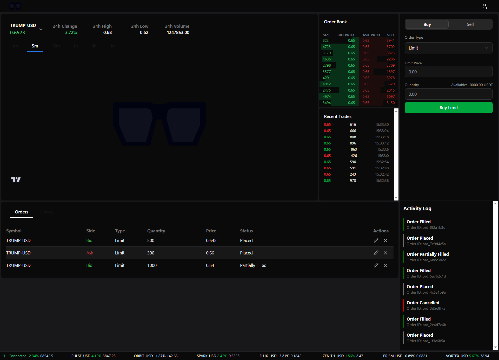
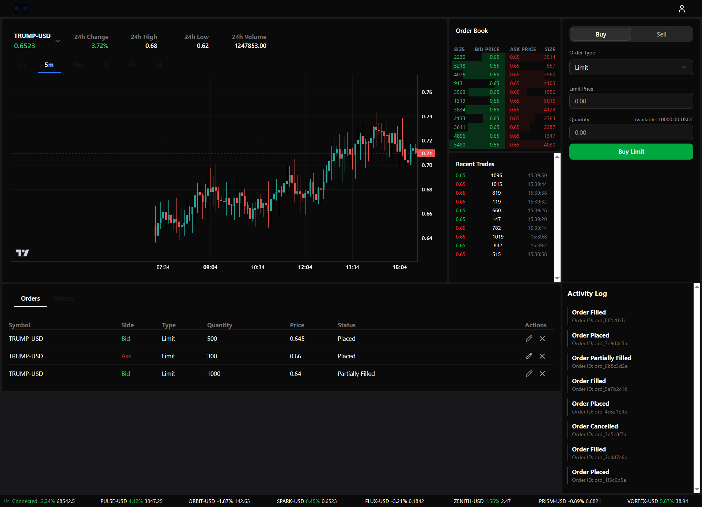

# Spectuel Frontend

A modern, real-time cryptocurrency trading platform frontend built with React, TypeScript, and Vite. This application provides a seamless trading experience with live market data, order management, and portfolio tracking through WebSocket connections.

## 🔗 Backend Repository

This frontend connects to the Spectuel backend API. For backend setup and documentation, visit:
[https://github.com/JadoreThompson/spectuel-backend](https://github.com/JadoreThompson/spectuel-backend)

## ✨ Features

### Real-Time Trading

- **Live Market Data**: Real-time price updates and candlestick charts via WebSocket connections
- **Order Management**: Place, modify, and cancel orders with instant feedback
- **Live Order Book**: Real-time order book updates showing market depth
- **Activity Log**: Live event stream showing order fills, cancellations, and system events

### Portfolio Management

- **Asset Overview**: View your portfolio distribution with interactive pie charts
- **Balance Tracking**: Real-time balance updates including available and escrowed funds
- **Asset Balances**: Detailed breakdown of all asset holdings
- **Transaction History**: Complete history of all trading activities

### Market Analysis

- **Interactive Charts**: Candlestick charts with multiple timeframes (1m, 5m, 15m, 1h, 4h, 1d)
- **Market Statistics**: 24-hour price changes, highs, lows, and volume
- **Multiple Markets**: Support for various trading pairs
- **Price Alerts**: Real-time price updates for active markets

### User Experience

- **Dark/Light Mode**: Toggle between themes for comfortable viewing
- **Responsive Design**: Optimized for desktop and mobile devices
- **Type-Safe**: Full TypeScript support with auto-generated API types
- **Modern UI**: Built with Radix UI and Tailwind CSS for a polished interface

## 📸 Screenshots

### Trading Interface


_Trading interface with chart loading state_


_Full trading interface with live market data_

## 🚀 Getting Started

### Prerequisites

- Node.js 18+ and npm/yarn/pnpm
- Access to the Spectuel backend API (see [backend repository](https://github.com/JadoreThompson/spectuel-backend))

### Installation

1. Clone the repository:

```bash
git clone https://github.com/yourusername/spectuel-frontend.git
cd spectuel-frontend
```

2. Install dependencies:

```bash
npm install
```

3. Configure the API endpoint:
   Create a `.env` file in the root directory:

```env
VITE_API_BASE_URL=http://localhost:8000
VITE_WS_URL=ws://localhost:8000
```

4. Start the development server:

```bash
npm run dev
```

The application will be available at `http://localhost:5173`

## 🛠️ Tech Stack

### Core

- **React 19** - UI framework
- **TypeScript** - Type safety
- **Vite** - Build tool and dev server
- **React Router 7** - Client-side routing

### State Management & Data Fetching

- **TanStack Query** - Server state management and caching
- **Zustand** - Client state management
- **WebSocket** - Real-time data streaming

### UI Components

- **Radix UI** - Accessible component primitives
- **Tailwind CSS** - Utility-first styling
- **shadcn/ui** - Pre-built component library
- **Lucide React** - Icon library
- **Sonner** - Toast notifications

### Charts & Visualization

- **Lightweight Charts** - High-performance candlestick charts
- **Recharts** - Portfolio pie charts and data visualization

### Code Generation

- **Orval** - Auto-generate TypeScript API client from OpenAPI spec

## 📁 Project Structure

```
src/
├── components/          # Reusable UI components
│   ├── ui/             # shadcn/ui components
│   ├── layouts/        # Layout components
│   ├── ChartPanel.tsx  # Trading chart component
│   ├── EventLog.tsx    # Activity log component
│   └── ...
├── hooks/              # Custom React hooks
│   ├── auth-hooks.ts   # Authentication hooks
│   ├── order-hooks.ts  # Order management hooks
│   ├── user-hooks.ts   # User data hooks
│   └── market-hooks.ts # Market data hooks
├── lib/                # Utility libraries
│   ├── query/          # TanStack Query configuration
│   ├── api/            # Auto-generated API client
│   └── utils.ts        # Helper functions
├── pages/              # Page components
│   ├── TradingPage.tsx # Main trading interface
│   ├── UserOverviewPage.tsx # Portfolio overview
│   ├── LoginPage.tsx   # Authentication
│   └── ...
├── stores/             # Zustand stores
├── types/              # TypeScript type definitions
└── App.tsx             # Root component
```

## 🔧 Available Scripts

- `npm run dev` - Start development server
- `npm run build` - Build for production
- `npm run preview` - Preview production build
- `npm run lint` - Run ESLint
- `npm run orval` - Generate API client from OpenAPI spec

## 🌐 Real-Time Features

The application maintains persistent WebSocket connections to the backend for real-time updates:

### Balance Updates

- Instant balance changes when orders are placed or filled
- Real-time escrow balance tracking
- Live available balance calculations

### Order Events

- Order placement confirmations
- Fill notifications with execution details
- Cancellation updates
- Order status changes

### Market Data

- Live price updates
- Real-time candlestick data
- Order book depth changes
- Trade execution stream

### Connection Management

- Automatic reconnection on disconnect
- Connection status indicators
- Graceful error handling

## 🔐 Authentication

The application uses JWT-based authentication:

1. **Register**: Create a new account with email and password
2. **Login**: Authenticate to receive access tokens
3. **Session Management**: Automatic token refresh and secure storage
4. **WebSocket Auth**: Separate WebSocket tokens for real-time connections

## 📊 Trading Workflow

1. **Select Market**: Choose a trading pair from the instrument selector
2. **Analyze**: View charts, order book, and recent trades
3. **Place Order**: Enter price and quantity, select order type (limit/market)
4. **Monitor**: Track order status in the activity log
5. **Manage**: View and cancel open orders as needed

## 🧪 Demo Mode

The application includes a `CloneTradingPage` with static dummy data for demonstration purposes:

- Pre-generated candlestick data
- Mock order book and trades
- No API calls or WebSocket connections
- Perfect for testing UI without backend

## 📝 API Client Generation

The API client is auto-generated from the backend's OpenAPI specification using Orval:

```bash
npm run orval
```

This generates TypeScript types and API functions in `src/lib/api/` based on the backend schema.

## 🤝 Contributing

Contributions are welcome! Please follow these guidelines:

1. Fork the repository
2. Create a feature branch (`git checkout -b feature/amazing-feature`)
3. Commit your changes (`git commit -m 'Add amazing feature'`)
4. Push to the branch (`git push origin feature/amazing-feature`)
5. Open a Pull Request

## 📄 License

This project is licensed under the MIT License.

## 🙏 Acknowledgments

- Built with [Vite](https://vitejs.dev/)
- UI components from [shadcn/ui](https://ui.shadcn.com/)
- Charts powered by [Lightweight Charts](https://tradingview.github.io/lightweight-charts/)
- Backend API: [Spectuel Backend](https://github.com/JadoreThompson/spectuel-backend)
